# Spring Boot, SAML, and Okta

A Spring Boot example app that shows how to implement single sign-on (SSO) with Spring Security's SAML DSL and Okta.

Please read [Get Started with Spring Boot, SAML, and Okta](https://developer.okta.com/blog/2017/03/16/spring-boot-saml) to see how this app was created.

**Prerequisites:** [Java 8](http://www.oracle.com/technetwork/java/javase/downloads/jdk8-downloads-2133151.html).

> [Okta](https://developer.okta.com/) has Authentication and User Management APIs that reduce development time with instant-on, scalable user infrastructure. Okta's intuitive API and expert support make it easy for developers to authenticate, manage and secure users and roles in any application.

* [Getting Started](#getting-started)
* [Links](#links)
* [Help](#help)
* [License](#license)

## Getting Started

To install this example application, run the following commands:

```bash
git clone https://github.com/oktadeveloper/okta-spring-boot-saml-example.git
cd okta-spring-boot-saml-example
```

This will get a copy of the project installed locally. To install all of its dependencies and start the app, run:
 
```bash
./mvnw spring-boot:run
```

### Create a SAML App in Okta

The first thing you'll need to do is create an Okta account at [okta.com/integrate/signup](https://www.okta.com/integrate/signup/). After activating your account, log in to it. If you just created an account, you'll see a screen similar to the one below.

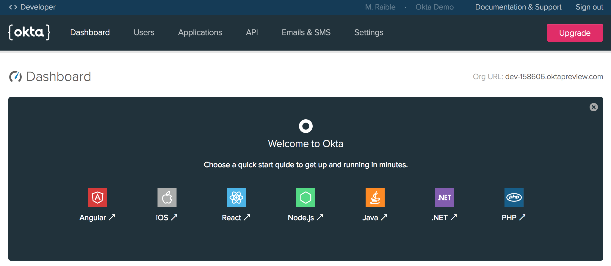
 
Click on **< > Developer Console** in the top-left corner and switch to the Classic UI. If you see a screen like the following, you're good to go! The reason you need to use the Classic UI for this tutorial is because we haven't yet added SAML support to the [Developer Console](/blog/2017/09/25/all-new-developer-console).

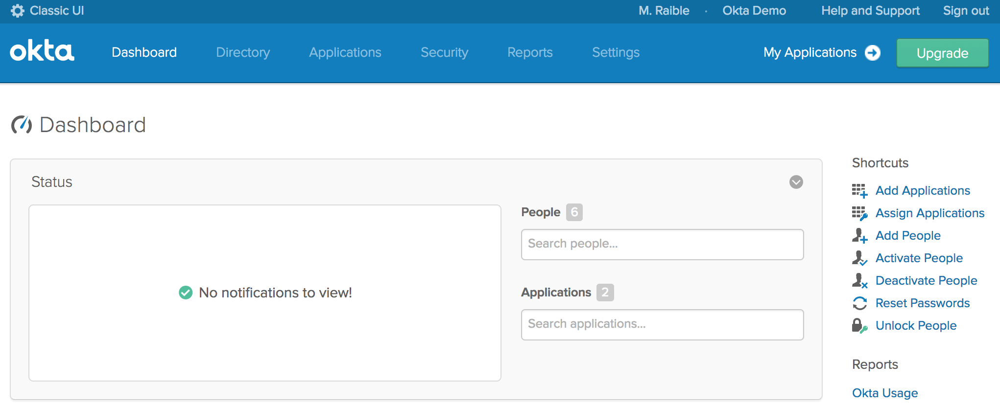

Click **Add Applications** in the top right to continue. This will bring you to a screen with a **Create New App** green button on the left.

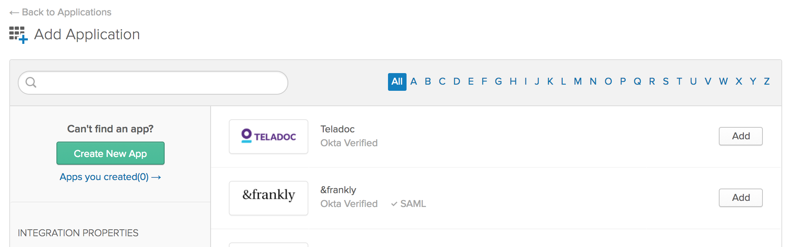

Click the button and choose **Web** for the platform and **SAML 2.0** for the sign on method.

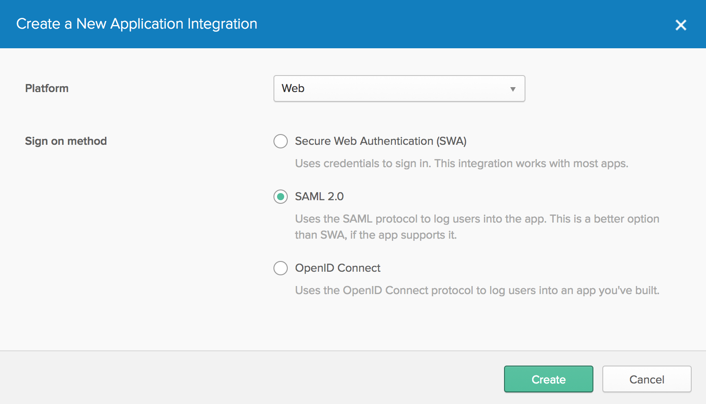

Click the **Create** button. The next screen will prompt you for an application name. I used "Spring SAML”, but any name will work.

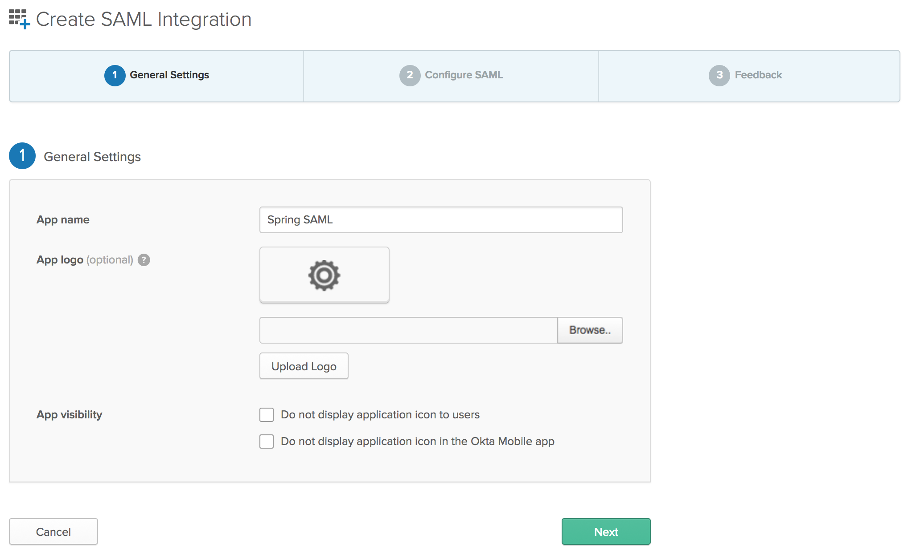

Click the **Next** button. This brings you to the second step, configuring SAML. Enter the following values:

* Single sign on URL: `https://localhost:8443/saml/SSO`
* Audience URI: `https://localhost:8443/saml/metadata`

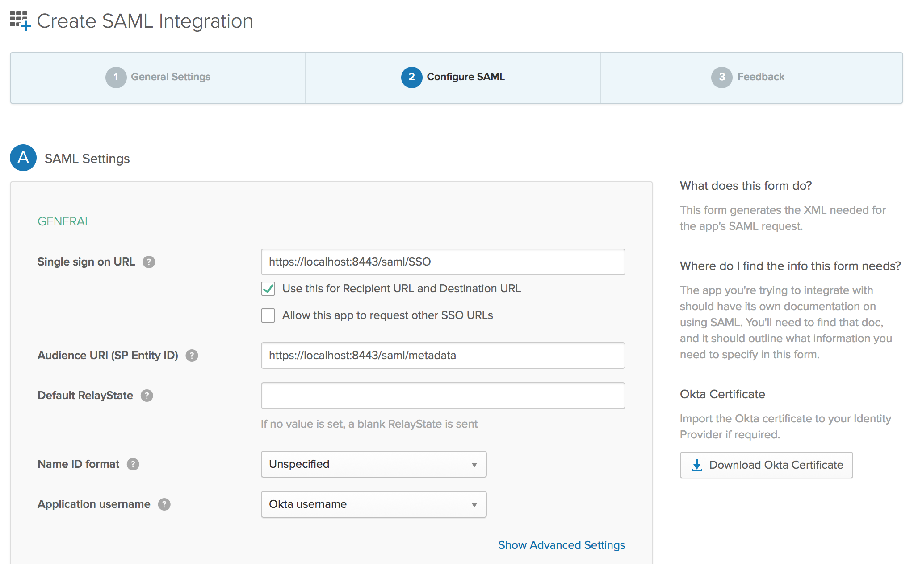

Scroll to the bottom of the form and click **Next**. This will bring you to the third step, feedback. Choose "I'm an Okta customer adding an internal app” and optionally select the App type.

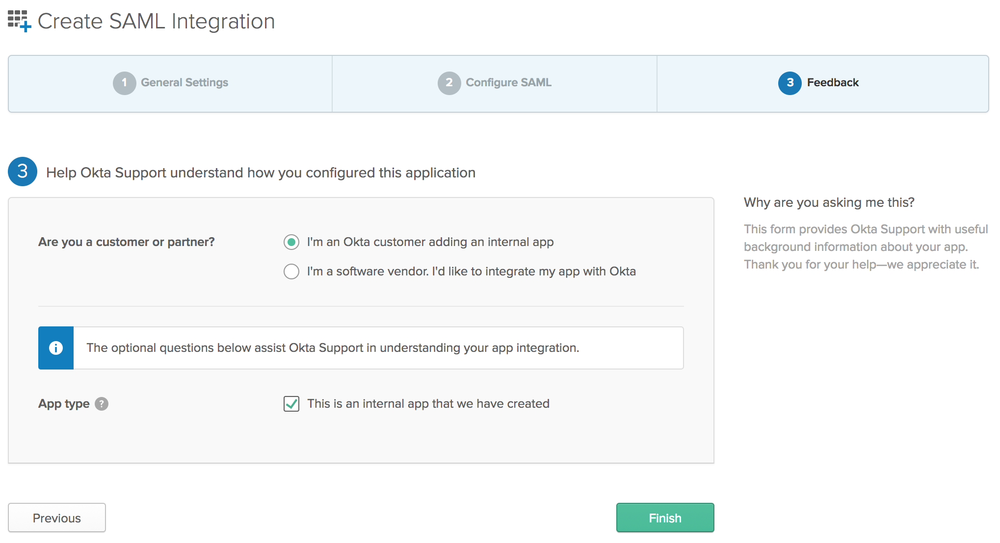

Click the **Finish** button to continue. This will bring you to the application's "Sign On” tab which has a section with a link to your applications metadata in a yellow box. Copy the **Identity Provider metadata** link as you'll need it to configure your Spring Boot application.

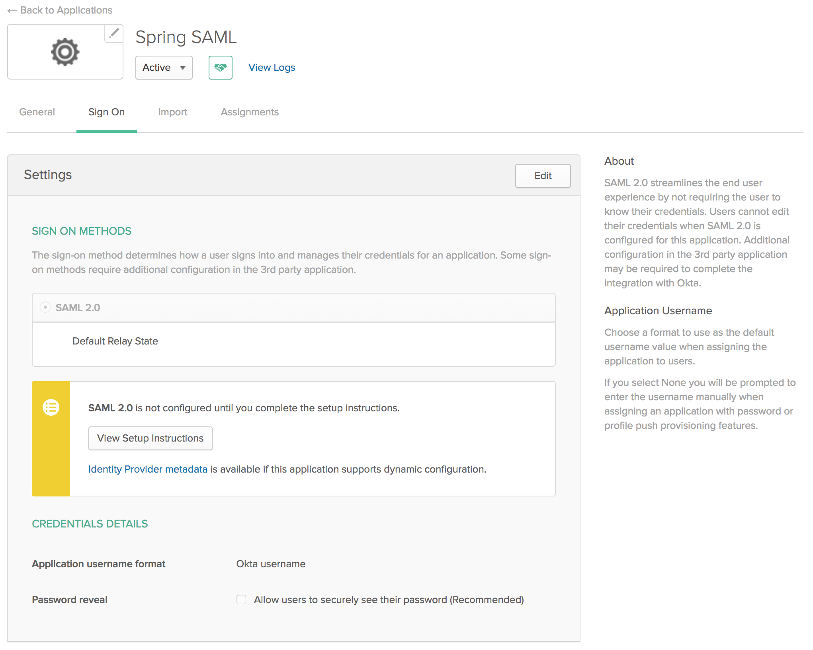

The final setup step you'll need is to assign people to the application. Click on the **Assignments** tab and the **Assign** > **Assign to People** button. You'll see a list of people with your account in it.

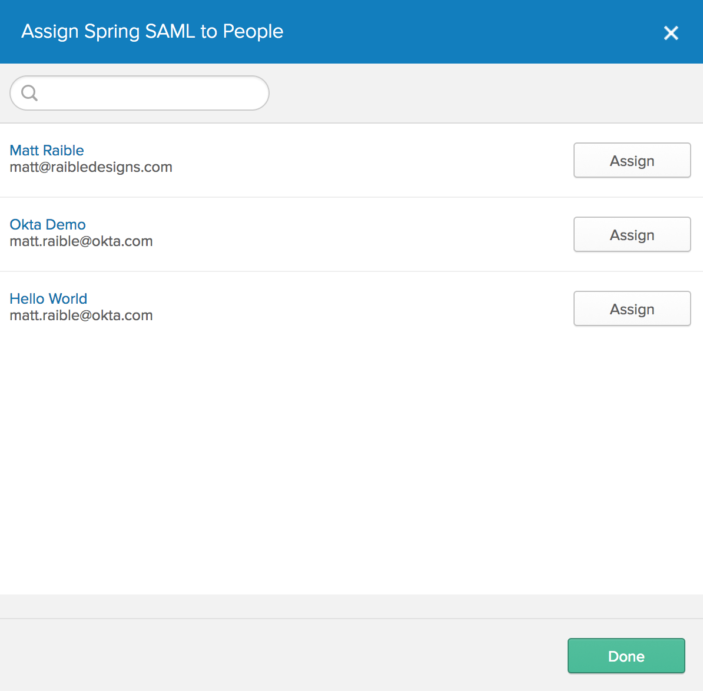

Click the **Assign** button, accept the default username (your email), and click the **Done** button.

Update `src/main/resources/application.properties`, to have the `metadata-url` for the app you just created. Make sure to use the "Identity Provider metadata" value you copied earlier (hint: you can find it again under the "Sign On” tab in your Okta application).

```properties
server.port = 8443
server.ssl.enabled = true
server.ssl.key-alias = spring
server.ssl.key-store = classpath:saml/keystore.jks
server.ssl.key-store-password = secret

security.saml2.metadata-url = <your metadata url>
```

### Run the App and Login with Okta

Start the app using your IDE or `mvn spring-boot:run` and navigate to `https://localhost:8443`. If you're using Chrome, you'll likely see a privacy error.

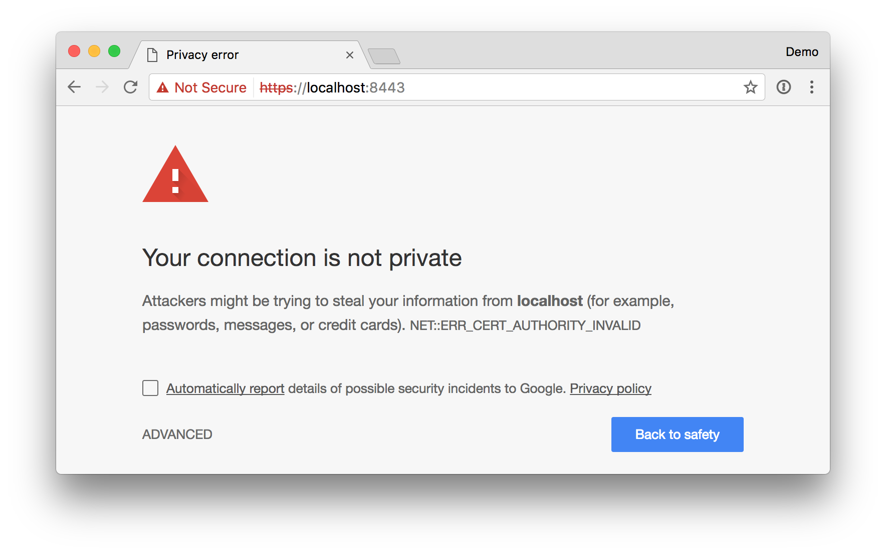

Click the "ADVANCED" link at the bottom. Then click the "proceed to localhost (unsafe)” link.

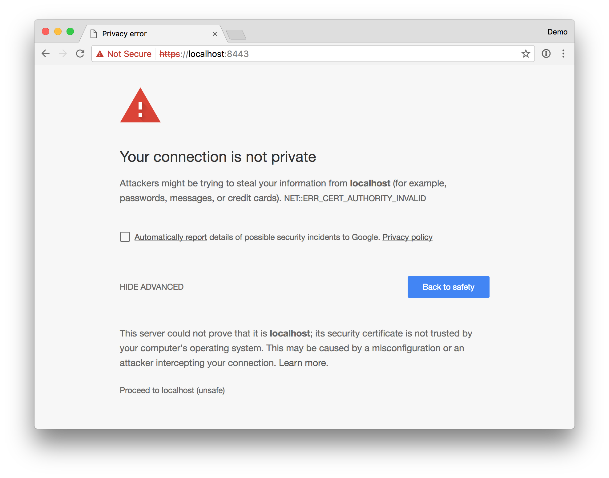

Next, you'll be redirected to Okta to sign in and redirected back to your app. If you're already logged in, you won't see anything from Okta. If you sign out from Okta, you'll see a login screen such as the one below.

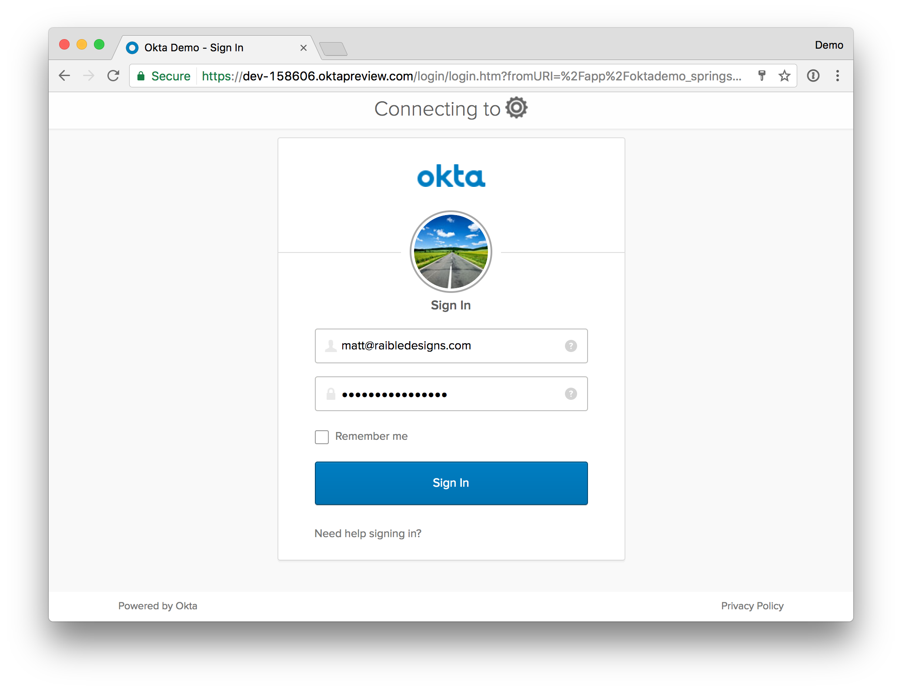

After you've logged in, you should see a screen like the one below.

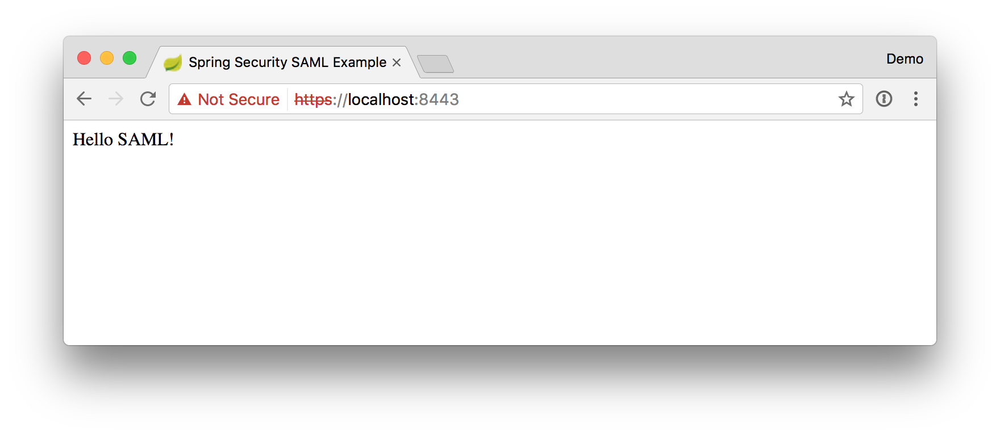

## Links

This example uses [Spring Security SAML DSL](https://github.com/spring-projects/spring-security-saml-dsl) to integrate with Okta. Kudos to the project's [spring-security-saml-dsl-sample for its instructions](https://github.com/spring-projects/spring-security-saml-dsl/blob/master/samples/spring-security-saml-dsl-sample/README.md).

## Help

Please post any questions as comments on the [blog post](http://developer.okta.com/blog/2017/03/16/spring-boot-saml), or visit our [Okta Developer Forums](https://devforum.okta.com/). You can also email developers@okta.com if would like to create a support ticket.

## License

Apache 2.0, see [LICENSE](LICENSE).

